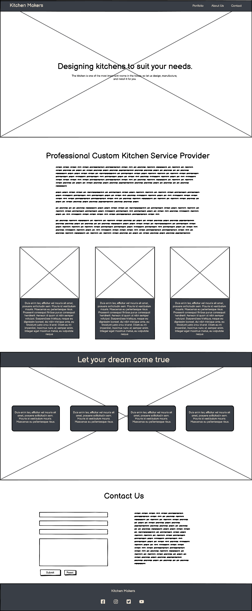

# $${\color{grey}ꓘ|M \space \color{beige}Kitchen \space Makers}$$

## **This project is a website for Kitchen Makers, a fictional company specializing in designing, manufacturing, and installing custom kitchens.**

---

### _Kitchen Makers' goal is to help customers create their dream kitchen by offering a wide variety of options and customizations. The website will provide customers with information about the company, its products and services, and the process of designing, manufacturing, and installing custom kitchens._

---

### [Live Site](https://jarekb-dev.github.io/KitchenMakers/)

---

### [Project Repository](https://github.com/JarekB-dev/KitchenMakers)

---

## Table of Contents

1. [UX](#ux)
2. [Features](#features)
3. [Features to implement](#implement)
4. [Technologies Used](#technologies)
5. [Testing](#testing)
6. [Deployment](#deployment)
7. [Resources](#resources)
8. [Credits](#credits)
9. [Acknowledgments](#acknowledgments)

# $${\color{orange}UX}$$

### During the design process, I approached it from two different perspectives - Client and Business Owner. The goals and priorities of each party are different and require different approaches to be able to fulfill their needs :

> Potential Client :

    - I would like to find company specialised in custom kitchens.
    - I would like to see what materials, brands and technology they use to make sure they will be able
    to fullfil all orders.
    - To make sure they are a trustworthy company, I would like to see their portfolio.
    - I would like to contact the company via phone or email.
    - I would like to know the showroom address and opening hours.

> Business Owner :

    - I would like to present my company to potential customers.
    - I would like my website to be fully responsive as currently more people
    view websites on mobile devices than desktops/laptops.
    - I would like to ensure potential customers that we are competent and experienced company.
    - I would like to showcase my previous projects.
    - I would like my customers to easily be able to navigate through our website and find
    contact information.
    - The majority of my customers prefer to communicate via email, so I would like to provide the option for them to do so.

### Based on the above considerations, I have decided to design my website with the following elements:

**Navigation Bar**

> Navigation bar with fixed position regardless of scrolling that will enable our users to jump to particular section within our website or external Portfolio.

**Landing Page**

> Landing Page with our slogan and message what we do.

**About us**

> In this section we provide information about our company, the technologies we use, as well as the materials and steps involved in designing a kitchen with the help of our designers.

**Contact**

> Contact form for customers prefering email communication as well as address, phone number and opening times.

**Portfolio**

> External site with photos of our previous projects to ensure potential customers that Kitchen Makers is reliable and expierienced company to work with.

## Theme

My decision was that the most effective way to design our site would be a minimalistic one, which would incorporate toned colors in order to create a contemporary and elegant look. I went with 3 colours:

    - #f7f7f7 - White with a shade of grey
    - #393e46 - Dark Grey
    - #f2e7d5 - Beige

I wanted to make sure that colors have proper contrast and are easily read by visual impaired users. Also, fonts have been chosen with same in mind to make sure that all information is clear and easy to read. Therefore, website contains 3 font types:

    - Loto
    - Mandali
    - Roboto

## Wireframes

### Desktop View

---

---

### Mobile View

---

# $${\color{orange}Features}$$

**Navigation Bar**

- Navigation Bar with fixed top position containing brand and links for quicker navigation.

**Hero Section**

- full size image with scale animation and slogan in the middle of the screen.

**About Us Section**

- Section showcasing Kitchen Makers profile and its values.

- 3 cards that tell potential customers more about the company.

- Steps potential customer will follow to have their dream kitchen designed and built.

> 

**Contact Us Section**

- Contact form for customers preferring this form of communication.

- Address of Kitchen Makers' Showroom and opening hours.

- Email address that can be clicked and email sent directly from users default email client because of mailto: property and phone number with tel: property.

- After submitting form user is taken to confirmation website to inform about successful input.

**Footer**

- Footer section with Kitchen Makers brand as well as links to social media that while clicked will open in new Tab.

**Portfolio**

- An external website that shares the same header and footer. In addition, the theme is the same for consistency and a better user experience. A few previous projects Kitchen Makers worked on were displayed as a way to show prospective customers that the company has quite a bit of experience in this field.

#### On smaller screens view will change to show 1 image at the time :

# $${\color{orange}Features \space to \space Implement}$$

## Navigation Bar

> I would like to make Navigation bar smaller when user will start scrolling down.
> Change link for "hamburger" menu on smaller devices so it will give up some space under the brand name.

## Hero Section

> Plan to add multiple full size images that will change after 10 seconds.

## About Us Section

> I would like to change cards for flip cards with image as full card size and text on the other side.
> I have an idea to change layout of design steps cards so they will appear one after another while scrolling down.

## Contact Us Section

> I would like to add "Chat with us" option at the right bottom side of the screen with popup window. That way potential clients will be able to contact us via instant messaging.

## Portfolio

> I would like to add functionality to images to show up as modal boxes while clicked on it, so user would be able to see full screen image.

# $${\color{orange}Technologies \space Used}$$

## HTML

> Used to properly structure my project.

## CSS

> Used to style my project and change layout of elements.

## Google Fonts

> Used for all fonts in my project.

## Favicon.cc

> Used to create Favicon Logo.

## Font Awesome

> Used to for social media icons in my project.

## Freeconvert.com

> Used to convert my images to Webp format for smaller sizes and improving loading times.

# $${\color{orange}Testing}$$

## Devices

#### In order to check responsiveness on different devices and to ensure that the website is easy to use, I tested the project myself with the help of my colleagues. The following devices were used for testing:

> Desktop with viewport 2560x1440

> Macbook Air with viewport 1440x900

> iPad with viewport of 768x1024

> iPhone 12 Pro with viewport of 390x844

- My project was fully responsive with proper and expected layout. All links and buttons were working correctly.

- Flexbox was working correctly with expected results.

- Portfolio images with Grid layout were behaving properly and changing to block display on smaller screens.

## User Testing

I have asked 5 users to check below functionality on their laptops and mobile devices:

1. Can you navigate through the website using scroll and/or navigation links.

2. Can you fill and submit contact form.

3. Can you find address and phone number to Kitchen Makers.

4. Can you find and visit Kitchen Makers social media.

5. Can you say what Kitchen Makers website is about.

6. Can you navigate to Portfolio and see previous projects.

7. Is contrast ratio enough for you to see text and information clearly.

Results of the test :

| Question | User 1 | User 2 | User 3 | User 4 | User 5 |
| -------- | ------ | ------ | ------ | ------ | ------ |
| 1        | Yes    | Yes    | Yes    | Yes    | Yes    |
| 2        | Yes    | Yes    | Yes    | Yes    | Yes    |
| 3        | Yes    | Yes    | Yes    | Yes    | Yes    |
| 4        | Yes    | Yes    | Yes    | Yes    | Yes    |
| 5        | Yes    | Yes    | Yes    | Yes    | Yes    |
| 6        | Yes    | Yes    | Yes    | Yes    | Yes    |
| 7        | Yes    | Yes    | Yes    | Yes    | Yes    |

---

## Google Chrome Lighthouse

1. Main Page

2. Portfolio

## HTML Validator

1. index.html

> Warnings regarding using a forward slash with a void (single tag) elements.

2. portfolio.html

## CSS Validator

## Bugs

1. Hero image causing horizontal scrolling because of animation - **FIXED**

2. Navigation Bar not changing layout properly for smaller devices - **FIXED**

3. About us cards not behaving for different screen sizes - **FIXED**

4. Adjusted paddings for sections to make up for fixed navigation bar to make sure it does not cover content - **FIXED**

5. Grid issue with correctly displaying images on portfolio.html site. - **FIXED**

# $${\color{orange}Deployment}$$

## Site was deployed using GitHub pages following steps below:

1. Navigate to repository that can be found here : [Repository](https://github.com/JarekB-dev/KitchenMakers)

2. Click on `Settings` in the navigation menu of _Kitchen Makers_ repository.

3. Select `Pages` in the left side navigation bar.

4. From the `Source` drop-down menu, select the `Deploy from a branch`.

5. From `Branch` drop-down select `main` branch.

6. Next drop-down menu should be `/(root)`.

7. Select `Save`.

8. After couple of minutes link to live website was shown above `Source` section.

# $${\color{orange}Resources}$$

### BEM

> BEM naming convention that help me with naming classes. - (https://getbem.com/introduction/)

### Reset CSS

> Reset Css by Josh Comeau helped me to override browser default settings - (https://www.joshwcomeau.com/css/custom-css-reset/)

### Kevin Powell

> Youtuber Kevin Powell helped me during this project with his tutorials and tips. - (https://www.youtube.com/@KevinPowell)

### Stack Overflow

> Used to overcome issues with horizontal scrolling with hero image. - (https://stackoverflow.com/)

### Color Hunt

> Used for color theme inspiration - (https://colorhunt.co/)

### Canva

> Helped me during this project with inspiration and layout - (https://www.canva.com/)

### Balsamiq

> Used to create Wireframes for this project. - (https://balsamiq.com/)

# $${\color{orange}Credits}$$

## Images :

- Hero Image - [Photo by Steven Ungermann from Unsplash](https://unsplash.com/photos/fZ1vlupgdSY).

- Card Latest Technology - [Photo from licon.pl ](https://licon.pl/rozkroj-ciecie-plyt/).

- Card Materials - [Photo from strefaplyt.pl](https://strefaplyt.pl/wizytowka/106).

- Card Custom Design - [Photo from maclorboy.com](https://www.malcorboy.com/our-story/index.php/2017/07/26/expect-interior-design-consultation).

- Design Steps Background - [Photo from jsdeco.co.uk](https://jsdeco.co.uk/egger-furniture-components-used-in-js-deco-products/).

- Portfolio image 1 - [Photo by Naomi Hebert from Unsplash.com](https://unsplash.com/photos/MP0bgaS_d1c).

- Portfolio image 2 - [Photo by Bilal Mansuri from Pexels.com](https://www.pexels.com/photo/brown-and-black-industrial-style-kitchen-9757618/).

- Portfolio image 3 - [Photo by Max Rahubovskiy from Pexels.com](https://www.pexels.com/photo/interior-of-contemporary-kitchen-with-wooden-table-and-furniture-in-modern-apartment-6284237/).

- Portfolio image 4 - [Photo by Mark McCammon from Pexels.com](https://www.pexels.com/photo/kitchen-and-dining-area-1080721/).

- Portfolio image 5 - [Photo by Mark McCammon from Pexels.com](https://www.pexels.com/photo/kitchen-with-furniture-and-appliances-2724748/).

- Portfolio image 6 - [Photo by Max Rahubovskiy from Pexels.com](https://www.pexels.com/photo/spacious-kitchen-with-black-leather-padded-bar-stools-and-wooden-cabinets-8089079/).

- Portfolio image 7 - [Photo from arredaremoderno.com](https://www.arredaremoderno.com/blog/en/kitchens-with-sliding-doors-photos-and-pictures/).

- Portfolio image 8 - [Photo by Sidekix Media from Unsplash.com](https://unsplash.com/photos/oCw5_evbWyI).

## All images were used for educational purposes only.

# $${\color{orange}Acknowledgments}$$

## Derek McAuley

> My Mentor that provided me with helpful tips, feedback and support during this project.
