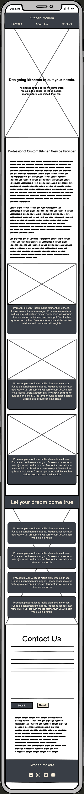

# $${\color{grey}ꓘ|M \space \color{beige}Kitchen \space Makers}$$

## **This project is a website for Kitchen Makers, a fictional company specializing in designing, manufacturing, and installing custom kitchens.**

---

### _Kitchen Makers' goal is to help customers create their dream kitchen by offering a wide variety of options and customizations. The website will provide customers with information about the company, its products and services, and the process of designing, manufacturing, and installing custom kitchens._

---

### [Live Site](https://jarekb-dev.github.io/KitchenMakers/)

---

### [Project Repository](https://github.com/JarekB-dev/KitchenMakers)

---

## Table of Contents

1. [UX](#ux)
2. [Features](#features)
3. [Testing](#testing)
4. [Technologies used](#technologies)
5. [Deployment](#deployment)
6. [Content](#content)
7. [Credits](#credits)
8. [Acknowledgments](#acknowledgments)

# $${\color{orange}UX}$$

### During the design process, I approached it from two different perspectives - Client and Business Owner. The goals and priorities of each party are different and require different approaches to be able to fulfill their needs :

> Potential Client :

- I would like to find company specialised in custom kitchens.
- I would like to see what materials, brands and technology they use to make sure they will be able to fullfil all orders.
- I would like to see portoflio of the company to make sure they are reliable company.
- I would like to contact the company via phone or email.
- I would like to know the showroom address and opening hours.

> Business Owner :

- I would like to present my company to potential customers.
- I would like my website to be fully responsive as currently more people view websites on mobile devices than desktops/laptops.
- I would like to ensure potential customers that we are competent and experienced company.
- I would like to showcase my previous projects.
- I would like my customers to easily be able to navigate through our website and find contact information.
- I would like to give opportunity my clients to contact us via email as some customers prefer this form of communication.

### After considering above, I have decided to struture my website with below elements:

**Navigation Bar**

> Navigation bar with fixed position regardless of scrolling that will enable our users to jump to particular section within our website or external Portfolio.

**Landing Page**

> Landing Page with our slogan and message what we do.

**About us**

> Section showcases our company and technologies we use as well as materials and steps of designing kitchen with help of our designers.

**Contact**

> Contact form for customers prefering email communication as well as address, phone number and opening times.

**Portfolio**

> External site with photos of our previous projects to ensure potential customers that Kitchen Makers is reliable and expierienced company to work with.

## Theme

My decision was that the most effective way to design our site would be a minimalistic one, which would incorporate toned colors in order to create a contemporary and elegant look. I went with 3 colours:

- #f7f7f7 - White with a shade of grey
- #393e46 - Dark Grey
- #f2e7d5 - Beige

I wanted to make sure that colors have proper contrast and are easily read by visual impaired users. Also, fonts have been chosen with same in mind to make sure that all information is clear and easy to read. Therefore, website contains 3 font types:

- Loto
- Mandali
- Roboto

## Wireframes

### Desktop View

---

---

### Mobile View

---

---

# $${\color{orange}Features}$$

**Navigation Bar**

> Navigation Bar with fixed top position containing brand and links for quicker navigation.

**Hero Section**

> full size image with scale animation and slogan in the middle of the screen.

**About Us Section**

Section showcasing company and its values followed with 3 cards that tell potential customers more about the company

